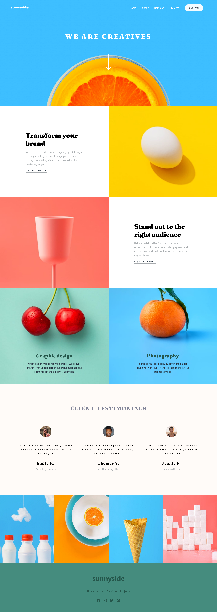

# Sunnyside Agency Landing Page

This project is a landing page template for a creative agency called Sunnyside. The website includes sections such as Home, About, Services, Client Testimonials, Projects, and Contact. It is built using HTML, CSS, and JavaScript, with the Bootstrap framework for responsive design and Font Awesome for icons.

This is a solution to the [Sunnyside agency landing page challenge on Frontend Mentor](https://www.frontendmentor.io/challenges/sunnyside-agency-landing-page-7yVs3B6ef).

## Table of Contents

- [Design](#design)
- [Usage](#usage)
- [Technologies Used](#technologies-used)
- [Features](#features)
- [Credits](#credits)
- [Links](#links)
- [Author](#author)

## Design

## Usage

- The landing page can be used as a template for creative agencies or startups.
- Customize the content in the HTML files and styles in the CSS files to match your needs.

## Technologies Used

- HTML5
- CSS3
- JavaScript
- Font Awesome
- Google Fonts

## Features

- **Responsive Design**: Ensures the website is responsive and mobile-friendly.
- **Customizable Sections**: Easily modify the content and style of various sections like Home, About, Services, Client Testimonials, Projects, and Contact.
- **Modern Design**: Uses modern web design practices with a clean and professional look.

## Credits

- **Font Awesome**: [https://fontawesome.com/](https://fontawesome.com/)
- **Google Fonts**: [https://fonts.google.com/](https://fonts.google.com/)

## Links

**GitHub-Repo**: [repo](https://github.com/basemsameh/Sunnyside-agency-landing-page.git)
**Demo**: [demo](https://basemsameh.github.io/Sunnyside-agency-landing-page/)

## Author

- Linkedin - [Basem Sameh](https://www.linkedin.com/in/basem-sameh-671b5b212/)
- Frontend Mentor - [@basemsameh](https://www.frontendmentor.io/profile/basemsameh)